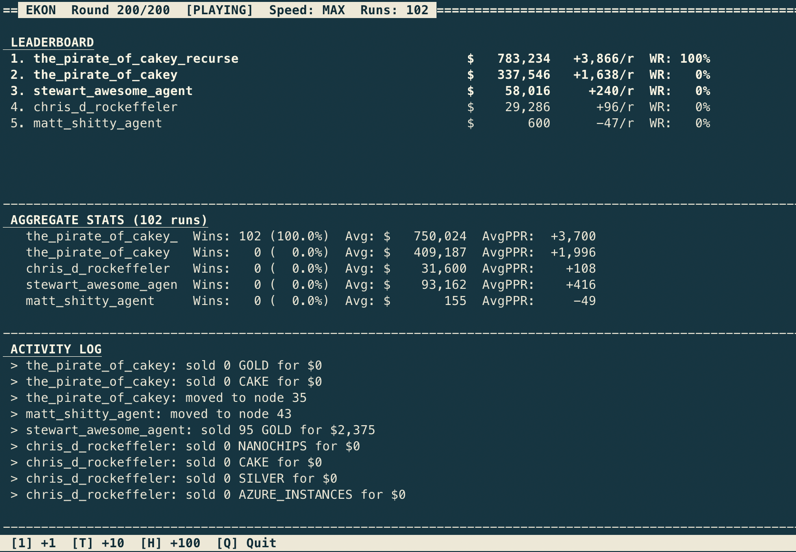

Ekon :moneybag:
====

A trading simulation where agents compete on a graph-based network of shops.



## Running

### Experiment Runner (Recommended for Testing)

Compare agents against the Pareto frontier with statistical analysis:

```bash
python3 experiment.py              # Run frontier agents (default)
python3 experiment.py --all        # Run ALL agents in registry
python3 experiment.py -n 50        # Run 50 simulations per agent
python3 experiment.py --all -n 100 # Run all agents, 100 sims each
python3 experiment.py --help       # Show all options
```

This runs experiments and reports:
- $/round, ms/round, efficiency for each agent
- Pareto dominance analysis (which agents should be kept/discarded)

Default: 30 runs with frontier agents. Use more runs (50-100) for reliable results.

### Visual Simulation

Watch agents compete in real-time:

```bash
python3 run_visual.py
```

Controls:
- `SPACE` - Play/Pause
- `N` - Step one round
- `M` - Max speed (no delay)
- `+/-` - Speed up/slow down
- `R` - Restart simulation
- `Q` - Quit

After simulation completes:
- `1` - Run 1 more
- `T` - Run 10 more
- `H` - Run 100 more

**Note:** This runs ALL agents in `agents/__init__.py`, not just the frontier.

### Headless Simulation

Run without visualization:

```bash
python3 sim.py
```

Runs all agents in the registry for a single game.

## Current Pareto Frontier

| Agent | $/round | ms/round | Efficiency | Notes |
|-------|---------|----------|------------|-------|
| blitz+nas | $3,748 | 0.007ms | 535,429 | Fastest |
| v1 | $5,023 | 0.052ms | 96,596 | Balanced-fast |
| v2+nas | $6,668 | 0.087ms | 76,644 | Best efficiency |
| v3 | $6,823 | 0.168ms | 40,613 | Max profit |

See `EXPERIMENTS.md` for full methodology and experiment history.

### Process

Every turn God iterates over the list of agents, calling them with the world state. The agent returns what resources they want to buy and sell at their **current node**, and what node they wish to move to.

### Example world state

    {
        'you': {
            'position': 2,
            'coin': 2000,
            'resources': {
                'bronze': 40,
                'gold' : 800,
            }
        },
        'meta':{
            "current_round" : 1,
            "total_rounds" : 10
        },
        'world': {
            0: {
                'neighbours': {1:1, 2:1, 3:1}
                'resources': {
                    'gold': {
                        'quantity': 5000,
                        'buy': 100
                        'sell': 100
                    }
                }
            }
            1: {
                'neighbours': {2:1}
                'resources': {
                    'bronze': {
                        'quantity': 5000,
                        'buy': 100,
                        'sell': 100
                    }
                }
            }
            2: {
                'neighbours': {1:1, 3:1}
                'resources': {
                    'silver': {
                        'quantity': 5000,
                        'buy': 100,
                        'sell': 100
                    }
                }
            }
            3: {
                'neighbours': {2: 1}
                'resources': {
                    'wood': {
                        'quantity': 5000,
                        'buy': 100,
                        'sell': 100
                    }
                }
            }
        }

    }

### Example message

    {
        'buy':   {"gold": 1000, "silver": 200},
        'sell':  {"wood": 300, "silver": 200},
        'move':   2,
    }

### Winning

Winner is the agent with the most coin at the end of the rounds.


### TODO

Vision:
Static Mine rate, Static graph
shops set prices and mine(and move)
agents move and buy/sell


* Pass location of other players?
* Regeneration of resources?
* Improve logging
* tournament harness with different parameters
* Static worldstates option
* Configuration  files

Done:
* ability to turn off logging
* cleanup buy/sell confusion
* clean up logging
* pass through round number so can sell off at end
* only accept integer values
* allow only % of edges
* allow to move to same location
* buy price should be < sell price
* shuffle order turn of players per round
* not all shops have all resources
